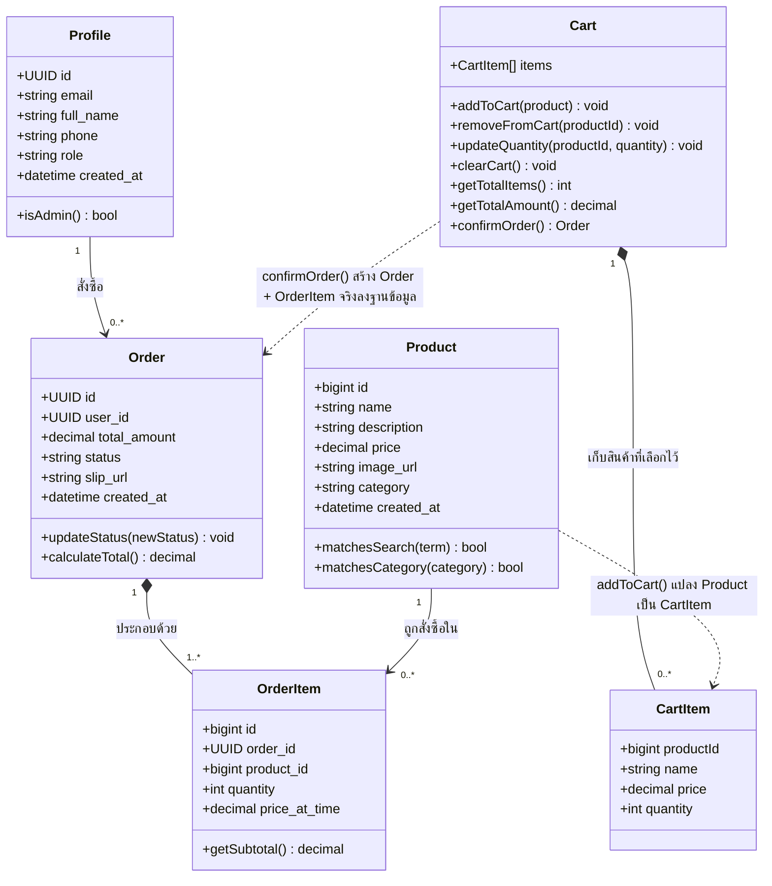

# Class Diagram

เอกสารนี้แสดงแบบจำลองคลาส (Class Diagram) ของโดเมนหลักในระบบ ตัวระบบไม่ได้เขียนด้วยภาษาเชิงวัตถุแบบมีคลาสจริงฝั่งเซิร์ฟเวอร์ (หน้าเว็บคุยกับฐานข้อมูล Supabase โดยตรง ดู [tech-stack.md](./tech-stack.md)) แต่แผนภาพนี้สรุป "แนวคิดเชิงวัตถุ" ของข้อมูลและพฤติกรรมในระบบ เพื่อให้เห็นโครงสร้างข้อมูลและความสัมพันธ์ชัดเจนตามหลัก SDLC อ่านคู่กับ [data-schema.md](./data-schema.md) ซึ่งเป็นโครงสร้างฐานข้อมูลจริง

## คำอธิบายแต่ละคลาส

| คลาส | หน้าที่ | ตารางฐานข้อมูลที่เกี่ยวข้อง |
| --- | --- | --- |
| Profile | ข้อมูลผู้ใช้และสิทธิ์การใช้งาน (`role` กำหนดว่าเป็นลูกค้าหรือแอดมิน) | `profiles` |
| Product | ข้อมูลสินค้า รองรับการค้นหา (`matchesSearch`) และกรองหมวดหมู่ (`matchesCategory`) ซึ่งทำงานฝั่งหน้าเว็บ ไม่ยิงคำขอใหม่ทุกครั้ง | `products` |
| Order | คำสั่งซื้อของลูกค้าหนึ่งรายการ มีสถานะที่แอดมินเปลี่ยนได้ผ่าน `updateStatus()` | `orders` |
| OrderItem | รายการสินค้าแต่ละชิ้นในคำสั่งซื้อ เก็บราคา ณ เวลาที่สั่งซื้อแยกจากราคาปัจจุบันของ Product | `order_items` |
| Cart | ตะกร้าสินค้าฝั่งหน้าเว็บ (เก็บใน browser ผ่าน `CartContext`) ไม่ใช่ตารางในฐานข้อมูล จนกว่าจะ `confirmOrder()` จึงจะกลายเป็น Order + OrderItem จริง | ไม่มี (runtime state เท่านั้น) |
| CartItem | สินค้าหนึ่งชิ้นที่อยู่ในตะกร้า พร้อมจำนวนที่เลือก | ไม่มี (runtime state เท่านั้น) |

## หมายเหตุการออกแบบ

- **Cart ไม่ใช่ตารางฐานข้อมูล** — เป็นสถานะชั่วคราวฝั่งหน้าเว็บเท่านั้น (เก็บอยู่ตราบใดที่ไม่ได้ล้าง browser storage) เพื่อให้ผู้เยี่ยมชมที่ยังไม่สมัครสมาชิกก็ใส่ตะกร้าได้ ก่อนจะบังคับให้เข้าสู่ระบบตอนยืนยันคำสั่งซื้อจริงเท่านั้น
- `isAdmin()` สอดคล้องกับฟังก์ชัน `is_admin()` ในฐานข้อมูล Supabase ที่ใช้เป็นจุดกลางตรวจสิทธิ์ในทุก RLS policy (ดู [data-schema.md](./data-schema.md))
- ความสัมพันธ์ Order–OrderItem เป็นแบบ composition (เส้นทึบมีข้าวหลามตัด) เพราะ OrderItem มีความหมายก็ต่อเมื่ออยู่ภายใต้ Order เท่านั้น ต่างจาก Product–OrderItem ที่เป็นแค่การอ้างอิง (reference)
