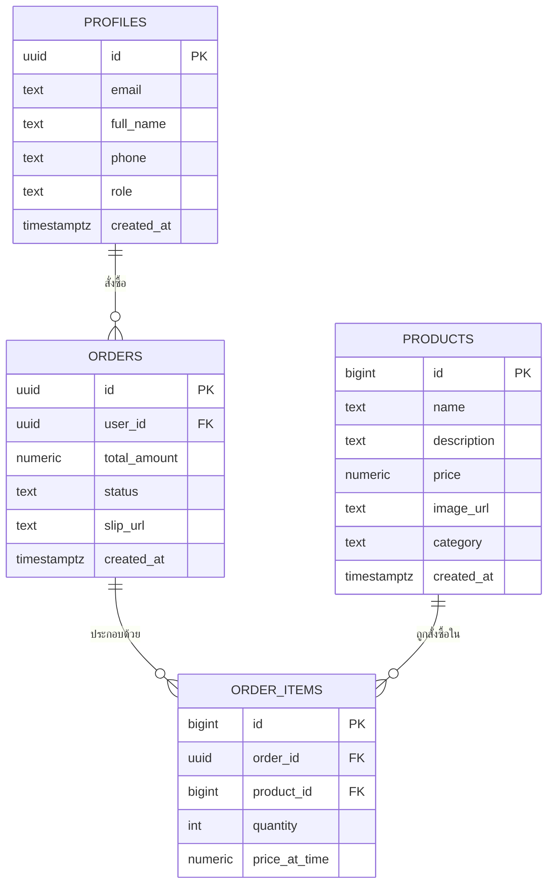

# โครงสร้างฐานข้อมูล (Data Schema)

เอกสารนี้อธิบายว่าฐานข้อมูลของโปรเจกต์เก็บข้อมูลอะไรบ้าง แต่ละตารางเก็บอะไร และเชื่อมโยงกันอย่างไร ฐานข้อมูลที่ใช้คือ Supabase ซึ่งอยู่บนเทคโนโลยี PostgreSQL

## แผนภาพความสัมพันธ์ของข้อมูล (ER Diagram)

## รายละเอียดแต่ละตาราง

### ตาราง profiles (ข้อมูลสมาชิก)

เก็บข้อมูลของผู้ใช้ทุกคนที่สมัครสมาชิก ตารางนี้ผูกกับระบบสมาชิกของ Supabase อัตโนมัติ (เมื่อสมัครสมาชิกใหม่ ระบบจะสร้างแถวในตารางนี้ให้เองทันที)

| คอลัมน์ | ความหมาย |
| --- | --- |
| id | รหัสประจำตัวผู้ใช้ ผูกกับระบบสมาชิกโดยตรง |
| email | อีเมลที่ใช้สมัคร |
| full_name | ชื่อ-นามสกุล |
| phone | เบอร์โทรศัพท์ |
| role | สิทธิ์การใช้งาน ค่าเริ่มต้นคือ "customer" (ลูกค้าทั่วไป) หากต้องการให้เป็นแอดมินต้องเปลี่ยนค่านี้เป็น "admin" ผ่านฐานข้อมูลโดยตรง |
| created_at | วันเวลาที่สมัครสมาชิก |

### ตาราง products (ข้อมูลสินค้า)

เก็บรายการเซ็ตคอมพิวเตอร์ที่ขาย เป็นตารางหลักที่หน้าแอดมินจัดการผ่านฟีเจอร์ เพิ่ม แก้ไข ลบ

| คอลัมน์ | ความหมาย |
| --- | --- |
| id | รหัสสินค้า |
| name | ชื่อสินค้า |
| description | รายละเอียด/จุดเด่นของสินค้า |
| price | ราคา (บาท) |
| image_url | ลิงก์รูปภาพสินค้า |
| category | หมวดหมู่สินค้า มีค่าได้ 4 แบบ คือ gaming (เกมมิ่ง) office (ทำงานออฟฟิศ) general (เรียน-ทำงานทั่วไป) creator (สตรีมมิ่ง/สร้างคอนเทนต์) ค่าเริ่มต้นคือ general |
| created_at | วันเวลาที่เพิ่มสินค้าเข้าระบบ |

### ตาราง orders (คำสั่งซื้อ)

เก็บคำสั่งซื้อของลูกค้าแต่ละครั้ง หนึ่งคำสั่งซื้ออาจมีสินค้าหลายชิ้น (ดูตาราง order_items)

| คอลัมน์ | ความหมาย |
| --- | --- |
| id | รหัสคำสั่งซื้อ |
| user_id | ลิงก์ไปยังผู้ใช้ที่สั่งซื้อ (ตาราง profiles) |
| total_amount | ยอดรวมของคำสั่งซื้อ |
| status | สถานะคำสั่งซื้อ มีค่าได้ 4 แบบ คือ pending (รอดำเนินการ) paid (ชำระแล้ว) shipped (จัดส่งแล้ว) cancelled (ยกเลิก) |
| slip_url | ลิงก์รูปสลิปโอนเงิน (สำหรับอนาคต เมื่อมีระบบตรวจสลิป) |
| created_at | วันเวลาที่สั่งซื้อ |

### ตาราง order_items (รายการสินค้าในคำสั่งซื้อ)

เป็นตารางเชื่อมระหว่างคำสั่งซื้อกับสินค้า เพราะหนึ่งคำสั่งซื้ออาจมีสินค้าหลายชิ้น

| คอลัมน์ | ความหมาย |
| --- | --- |
| id | รหัสรายการ |
| order_id | ลิงก์ไปยังคำสั่งซื้อ |
| product_id | ลิงก์ไปยังสินค้าที่สั่ง |
| quantity | จำนวนที่สั่งซื้อ |
| price_at_time | ราคาสินค้า ณ เวลาที่สั่งซื้อ (เก็บแยกจากราคาปัจจุบันในตาราง products เผื่อภายหลังราคาสินค้าจะเปลี่ยน) |

## การป้องกันข้อมูล (Row Level Security)

ทุกตารางเปิดใช้งาน Row Level Security (RLS) ซึ่งเป็นระบบของ Supabase ที่ควบคุมว่าใครอ่าน/แก้ไข/ลบข้อมูลแถวไหนได้บ้าง กฎที่ตั้งไว้ในโปรเจกต์นี้สรุปได้ดังนี้

| ตาราง | ใครอ่านได้ | ใครเพิ่ม/แก้/ลบได้ |
| --- | --- | --- |
| products | ทุกคน (แม้ไม่ได้เข้าสู่ระบบ) เพราะต้องเปิดให้ลูกค้าดูสินค้าได้ | เฉพาะแอดมิน |
| profiles | เจ้าของข้อมูลอ่านของตัวเองได้ แอดมินอ่านได้ทุกคน | เจ้าของข้อมูลแก้ไขของตัวเองได้เท่านั้น |
| orders | เจ้าของคำสั่งซื้ออ่านของตัวเองได้ แอดมินอ่านได้ทุกรายการ | เจ้าของบัญชีสร้างคำสั่งซื้อของตัวเองได้ / แอดมินแก้ไขสถานะได้ทุกรายการ |
| order_items | อ่านได้เมื่อคำสั่งซื้อนั้นเป็นของตัวเอง หรือเป็นแอดมิน | เพิ่มได้เมื่อคำสั่งซื้อนั้นเป็นของตัวเอง |

กฎเหล่านี้ถูกเพิ่มเข้ามาเพื่อแก้ปัญหาที่พบก่อนหน้านี้ คือ ตารางเปิด RLS ไว้แต่ไม่มีกฎอนุญาตเลยแม้แต่ข้อเดียว ทำให้ทุกคนอ่านข้อมูลไม่ได้เลย (ดูรายละเอียดใน [test-report.md](./test-report.md))

## หมายเหตุเรื่องตารางที่ยังไม่ได้ใช้งาน

ในฐานข้อมูลมีตารางชื่อ `profiles_admin` อยู่ด้วย แต่ตรวจสอบแล้วพบว่าหน้าเว็บไม่ได้เรียกใช้ตารางนี้เลย และไม่มีข้อมูลอยู่ในตาราง คาดว่าเป็นตารางที่เคยทดลองสร้างไว้ในช่วงพัฒนาก่อนหน้า ตารางนี้มีกฎ RLS ที่เปิดกว้างเกินไป (อนุญาตทุกการกระทำแบบไม่จำกัด) จึงแนะนำให้พิจารณาลบตารางนี้ทิ้งในการดูแลรักษาระบบครั้งถัดไป เพื่อลดความเสี่ยงด้านความปลอดภัย
