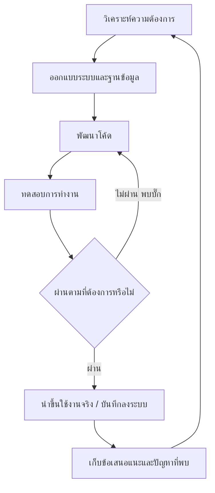

# วงจรการพัฒนาโปรเจกต์ (SDLC)

เอกสารนี้อธิบายว่าโปรเจกต์นี้พัฒนากันมาอย่างไร ตั้งแต่เริ่มต้นจนถึงตอนนี้ และรูปแบบการพัฒนาที่ใช้อยู่

## รูปแบบการพัฒนาที่ใช้ในโปรเจกต์นี้

โปรเจกต์นี้พัฒนาแบบ **ทำทีละรอบเล็กๆ แล้วปรับปรุงต่อเนื่อง (Iterative Development)** คือไม่ได้วางแผนทำทุกฟีเจอร์ให้เสร็จสมบูรณ์ในครั้งเดียว แต่ทำทีละส่วน ทดสอบ แล้วค่อยแก้ไขปรับปรุงในรอบถัดไป ซึ่งเหมาะกับโปรเจกต์ขนาดเล็กถึงกลางที่ทีมงานไม่ใหญ่มาก และต้องการเห็นผลลัพธ์ที่ใช้งานได้จริงเร็วๆ

## ขั้นตอนแต่ละช่วง (อธิบายแบบง่าย)

1. **วิเคราะห์ความต้องการ**: ดูว่าลูกค้าและแอดมินต้องการอะไร เช่น "แอดมินต้องเพิ่ม/แก้ไข/ลบสินค้าได้"
2. **ออกแบบระบบและฐานข้อมูล**: วางแผนว่าจะเก็บข้อมูลอะไรในตารางไหน และหน้าจอควรมีอะไรบ้าง
3. **พัฒนาโค้ด**: ลงมือเขียนหน้าเว็บและปรับแก้ฐานข้อมูลตามที่ออกแบบไว้
4. **ทดสอบการทำงาน**: ลองใช้งานจริงผ่านเบราว์เซอร์ ตรวจสอบว่าทำงานถูกต้องตามที่ตั้งใจ (ดูตัวอย่างการทดสอบใน [test-report.md](./test-report.md))
5. **นำขึ้นใช้งานจริง**: เมื่อพร้อมแล้วนำโค้ดขึ้นเว็บไซต์จริงให้ผู้ใช้ทั่วไปเข้าถึงได้
6. **เก็บข้อเสนอแนะและปัญหาที่พบ**: บันทึกปัญหาหรือฟีเจอร์ที่อยากได้เพิ่ม แล้ววนกลับไปวิเคราะห์ความต้องการรอบใหม่

## ประวัติการพัฒนาที่ผ่านมาโดยสรุป

จากการตรวจสอบประวัติการแก้ไขโค้ดของโปรเจกต์ สามารถสรุปรอบการพัฒนาที่ผ่านมาได้ดังนี้ (เรียงจากอดีตถึงปัจจุบัน)

1. สร้างโครงสร้างโปรเจกต์เริ่มต้น (หน้าเว็บ React และระบบเซิร์ฟเวอร์เบื้องต้น)
2. เชื่อมต่อฐานข้อมูล Supabase เข้ากับโปรเจกต์
3. เพิ่มระบบสมาชิกและแอดมิน พร้อมแก้ไขบั๊กเรื่องการลบข้อมูล
4. ซ่อนปุ่มแอดมินสำหรับผู้ใช้ทั่วไป และปรับแก้การแสดงผล
5. ปรับปรุงหน้าตาและประสบการณ์ใช้งาน (UX/UI)
6. พบและแก้ไขปัญหาแอดมินเข้าหน้าได้แต่สินค้าไม่แสดง
7. **รอบปัจจุบัน**: แก้ต้นเหตุของปัญหาสินค้าหาย (กฎความปลอดภัยของฐานข้อมูล) เพิ่มระบบจัดการสินค้าครบวงจร และจัดทำเอกสารชุดนี้

## เครื่องมือที่ใช้ในกระบวนการพัฒนา

- **Git และ GitHub**: บันทึกประวัติการแก้ไขโค้ด ย้อนดูได้ว่าใครแก้อะไรเมื่อไร
- **Supabase Dashboard**: ตรวจสอบข้อมูลในฐานข้อมูลและปรับกฎความปลอดภัย
- **การทดสอบผ่านเบราว์เซอร์จริง**: ก่อนปิดงานแต่ละรอบ จะมีการเปิดเว็บไซต์จริงและลองกดใช้งานทุกฟีเจอร์ที่แก้ไข ไม่ใช่แค่ดูโค้ดเฉยๆ
