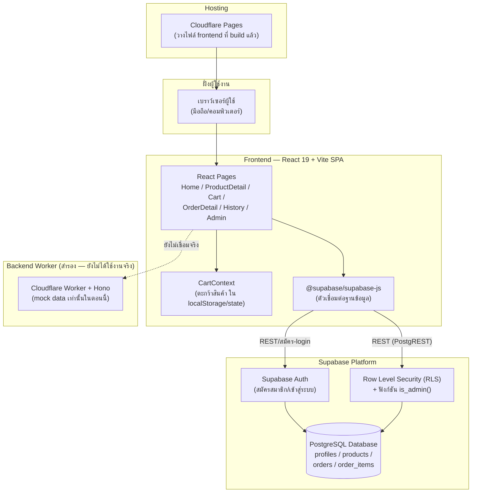

# System Architecture

เอกสารนี้แสดงภาพรวมสถาปัตยกรรมระบบทั้งหมด อธิบายเป็นข้อความอยู่แล้วใน [tech-stack.md](./tech-stack.md) เอกสารนี้เพิ่มแผนภาพให้เห็นภาพชัดเจนตามหลัก SDLC

## แผนภาพสถาปัตยกรรมระบบ

## คำอธิบายแต่ละชั้น

| ชั้น | รายละเอียด |
| --- | --- |
| **ฝั่งผู้ใช้งาน** | ผู้เยี่ยมชม ลูกค้า และแอดมิน เข้าเว็บผ่านเบราว์เซอร์ ไม่ต้องติดตั้งแอปเพิ่ม |
| **Frontend (React SPA)** | ทำงานทั้งหมดฝั่งเบราว์เซอร์ (Single Page Application) ไม่มีเซิร์ฟเวอร์กลางของตัวเองที่รับคำขอ ตะกร้าสินค้าเก็บเป็น state ชั่วคราวในเครื่องผู้ใช้ผ่าน `CartContext` จนกว่าจะยืนยันคำสั่งซื้อจริง |
| **Supabase Platform** | ทำหน้าที่เป็นทั้งฐานข้อมูล (PostgreSQL) และระบบสมาชิก (Auth) ในตัวเดียว ควบคุมสิทธิ์การเข้าถึงข้อมูลด้วย Row Level Security (RLS) ที่ระดับฐานข้อมูลโดยตรง ไม่ใช่แค่ซ่อนปุ่มในหน้าเว็บ ทำให้ปลอดภัยแม้มีคนพยายามเรียก API ตรงข้ามหน้าเว็บ |
| **Backend Worker (สำรอง)** | โค้ด Cloudflare Worker ที่เตรียมไว้สำหรับงานที่ควรทำผ่านเซิร์ฟเวอร์ (เช่น ตรวจสลิปโอนเงินอัตโนมัติในอนาคต) ปัจจุบันหน้าเว็บจริงยังไม่เรียกใช้ ส่งกลับแค่ mock data |
| **Hosting** | แผนวางไฟล์ frontend ที่ build แล้วบน Cloudflare Pages ให้บุคคลทั่วไปเข้าถึงได้ |

## เหตุผลเชิงสถาปัตยกรรมที่สำคัญ

1. **ไม่มีเซิร์ฟเวอร์กลางสำหรับงานพื้นฐาน (CRUD)** — เพราะ Supabase มี RLS ในตัว ลดความซับซ้อนและเวลาพัฒนาของโปรเจกต์ขนาดเล็ก-กลางแบบนี้
2. **แยก Backend Worker ไว้ต่างหากล่วงหน้า** — เผื่อในอนาคตต้องเรียกบริการภายนอก (เช่น ตรวจสลิปธนาคาร) ซึ่งไม่ควรทำจากฝั่งเบราว์เซอร์โดยตรง (เสี่ยงเรื่อง API key รั่วไหล)
3. **ตะกร้าสินค้าเป็น client-side state ล้วนๆ** — เพื่อให้ผู้เยี่ยมชมที่ยังไม่สมัครสมาชิกก็ใช้งานตะกร้าได้ทันที ไม่ต้องสร้างบัญชีก่อน ค่อยบังคับเข้าสู่ระบบตอนยืนยันคำสั่งซื้อจริงเท่านั้น
4. **E2E Testing ด้วย Playwright** — ครอบคลุม Homepage / Cart / Stock behavior ทั้งหมด 23 test cases
