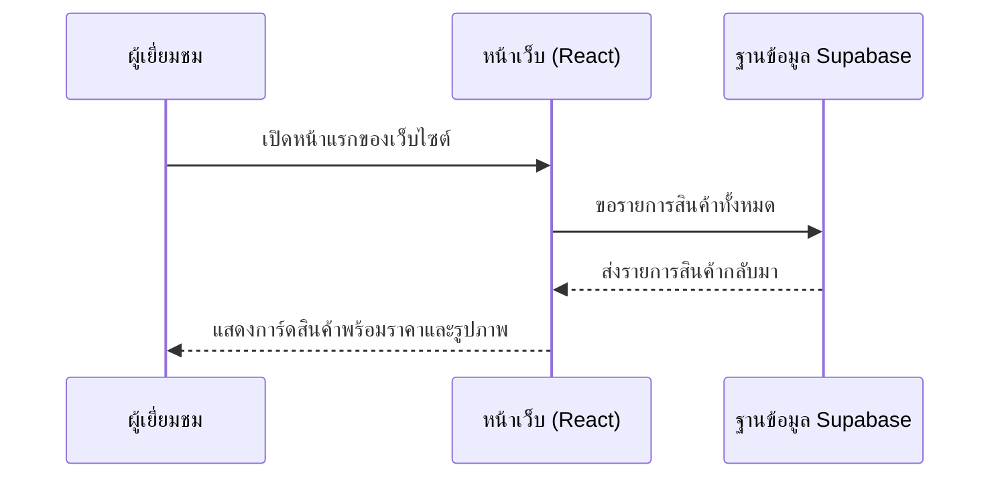
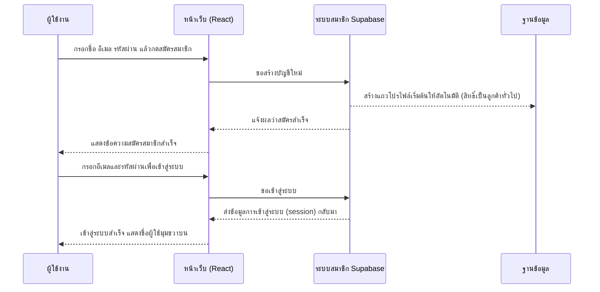
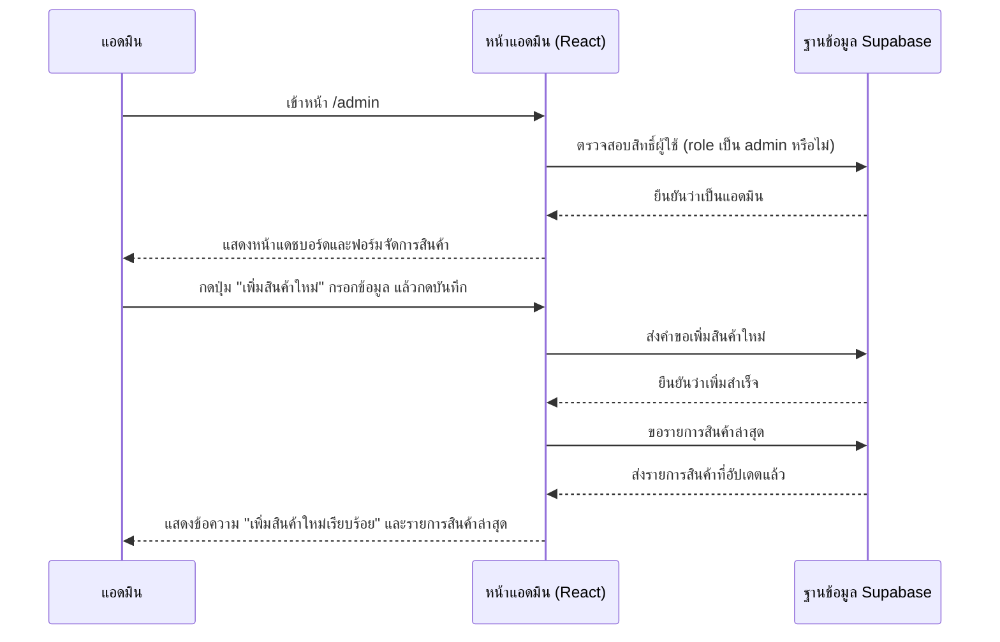
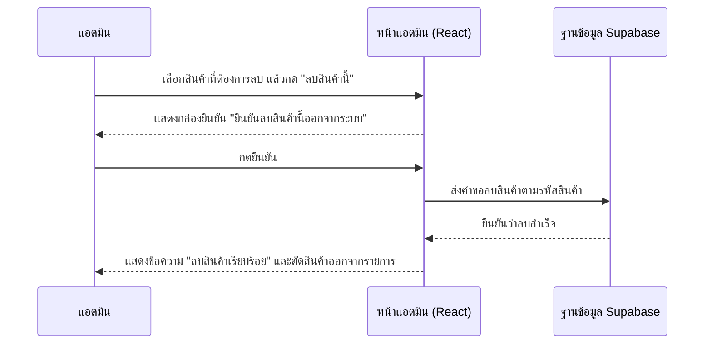
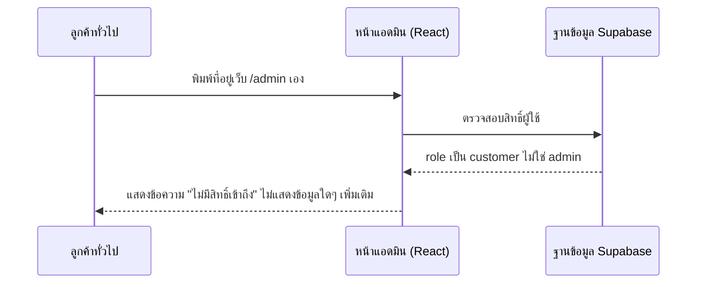

# แผนภาพการใช้งานระบบ (Use Case และ Sequence Diagram)

เอกสารนี้ใช้ภาพช่วยอธิบายว่าใครทำอะไรได้บ้างในระบบ และแต่ละการทำงานมีขั้นตอนอย่างไร อ่านควบคู่กับ [how-it-works.md](./how-it-works.md) จะเห็นภาพชัดขึ้น

## แผนภาพการใช้งานระบบ (Use Case Diagram)

แผนภาพนี้แสดงว่าผู้ใช้แต่ละแบบทำอะไรกับระบบได้บ้าง

```mermaid
flowchart LR
    subgraph ผู้ใช้งาน
        guest((ผู้เยี่ยมชม))
        customer((ลูกค้าสมาชิก))
        admin((แอดมิน))
    end

    subgraph การทำงานของระบบ
        uc1[ดูรายการสินค้า]
        uc2[ใส่สินค้าลงตะกร้า]
        uc3[สมัครสมาชิก / เข้าสู่ระบบ]
        uc4[แก้ไขข้อมูลส่วนตัว]
        uc5[ดูประวัติคำสั่งซื้อ]
        uc6[เพิ่มสินค้าใหม่]
        uc7[แก้ไขข้อมูลสินค้า]
        uc8[ลบสินค้า]
        uc9[ดูแดชบอร์ดสรุปยอดขาย]
    end

    guest --> uc1
    guest --> uc2
    guest --> uc3

    customer --> uc1
    customer --> uc2
    customer --> uc4
    customer --> uc5

    admin --> uc1
    admin --> uc6
    admin --> uc7
    admin --> uc8
    admin --> uc9
```

หมายเหตุ: "ดูประวัติคำสั่งซื้อ" ในแผนภาพนี้หมายถึงหน้าที่มีอยู่ในเว็บไซต์ แต่ปัจจุบันยังเป็นหน้าว่างเปล่าเพราะระบบสั่งซื้อจริงยังไม่ถูกพัฒนา (ดู [analysis-and-design.md](./analysis-and-design.md))

## Sequence Diagram: ผู้เยี่ยมชมดูสินค้าหน้าแรก



## Sequence Diagram: สมัครสมาชิกและเข้าสู่ระบบ



## Sequence Diagram: แอดมินเพิ่มสินค้าใหม่



## Sequence Diagram: แอดมินลบสินค้า



## Sequence Diagram: ผู้ใช้ทั่วไปพยายามเข้าหน้าแอดมิน (ถูกปฏิเสธสิทธิ์)


