# แผนภาพการใช้งานระบบ (Use Case และ Sequence Diagram)

เอกสารนี้ใช้ภาพช่วยอธิบายว่าใครทำอะไรได้บ้างในระบบ และแต่ละการทำงานมีขั้นตอนอย่างไร อ่านควบคู่กับ [how-it-works.md](./how-it-works.md) และ [personas.md](./personas.md) จะเห็นภาพชัดขึ้น

## แผนภาพการใช้งานระบบ (Use Case Diagram)

แผนภาพนี้แสดงว่าผู้ใช้แต่ละแบบทำอะไรกับระบบได้บ้าง

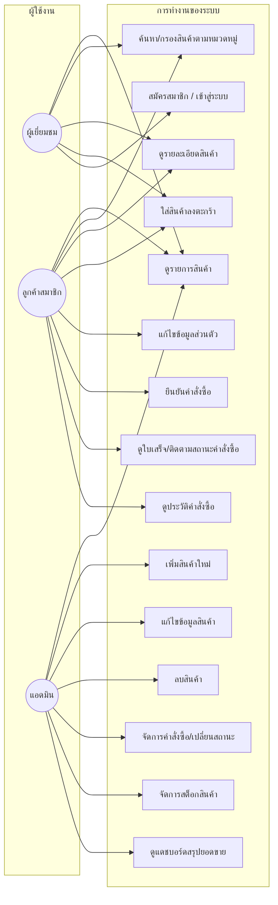

**หมายเหตุ:** `uc12` (ยืนยันคำสั่งซื้อ) และ `uc13`/`uc5` (ดูสถานะ/ประวัติคำสั่งซื้อ) ต้องเข้าสู่ระบบก่อน ผู้เยี่ยมชมสามารถใส่สินค้าในตะกร้าและสมัครสมาชิกได้เท่านั้น `uc15` (จัดการสต็อก) รวมถึงการดูวิดเจ็ตสินค้าใกล้หมดและแก้ไขจำนวนสต็อกในฟอร์มสินค้า

## Sequence Diagram: ผู้เยี่ยมชมดูสินค้าหน้าแรก

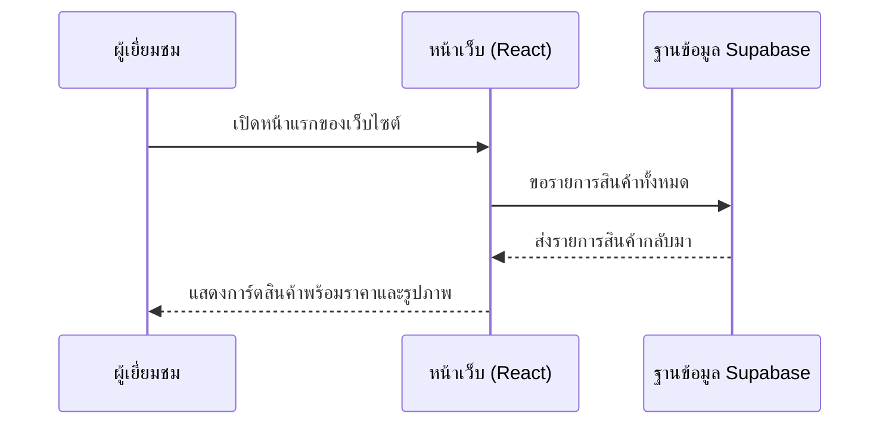

## Sequence Diagram: ค้นหาและกรองสินค้าตามหมวดหมู่

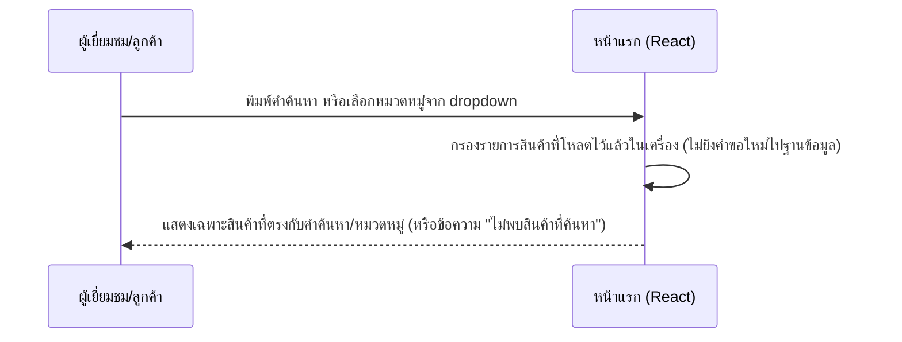

## Sequence Diagram: ดูรายละเอียดสินค้า

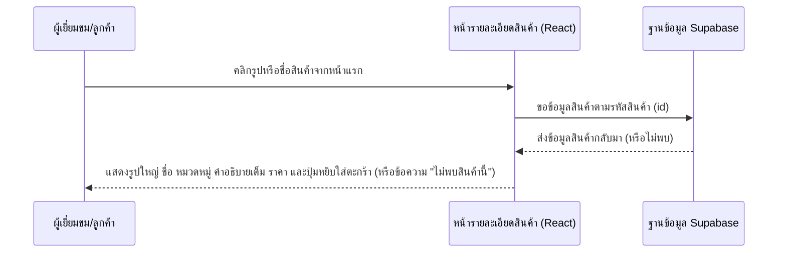

## Sequence Diagram: สมัครสมาชิกและเข้าสู่ระบบ

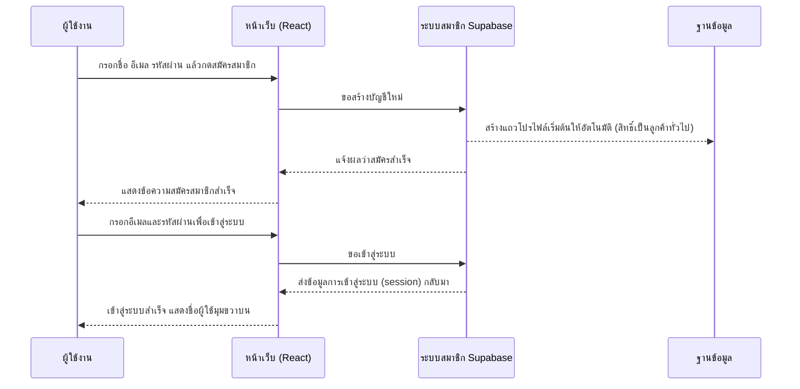

## Sequence Diagram: ลูกค้ายืนยันคำสั่งซื้อ

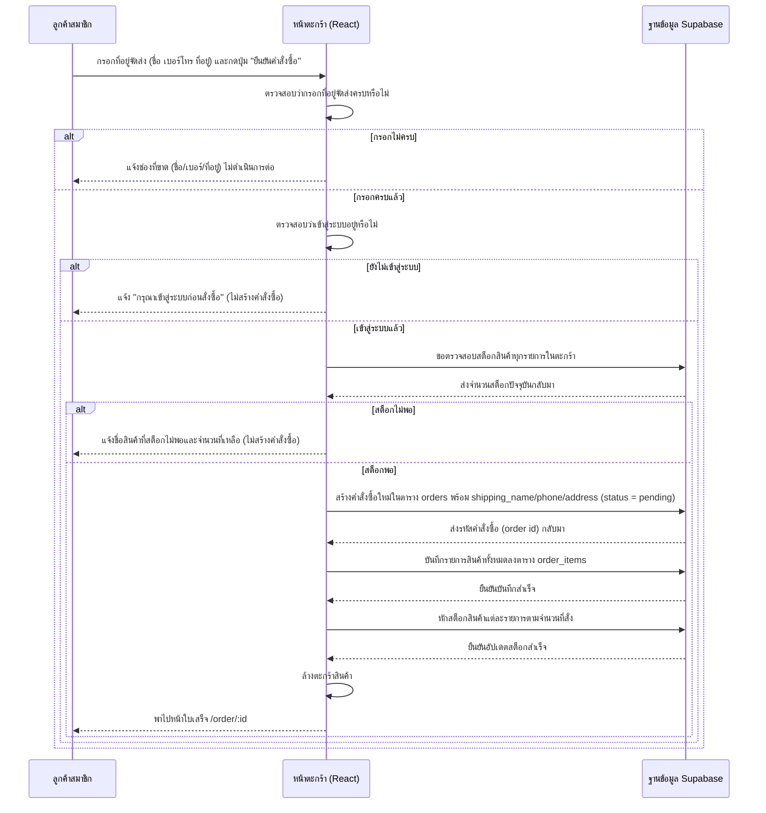

## Sequence Diagram: ลูกค้าดูใบเสร็จและติดตามสถานะคำสั่งซื้อ

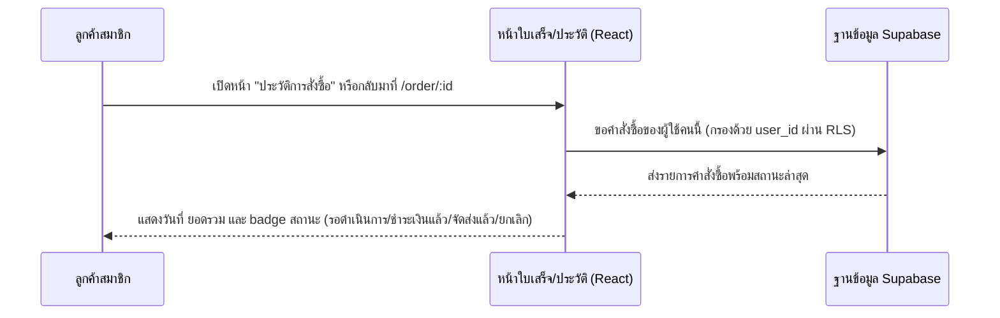

## Sequence Diagram: แอดมินเพิ่มสินค้าใหม่

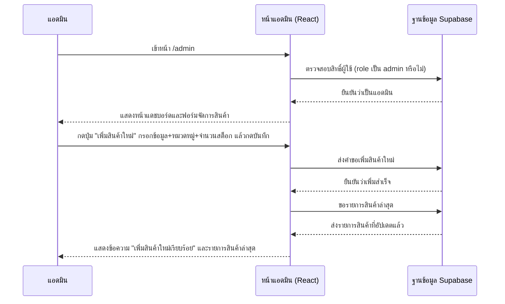

## Sequence Diagram: แอดมินลบสินค้า

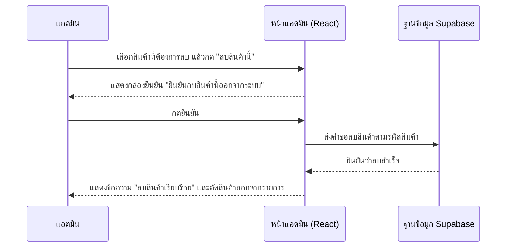

## Sequence Diagram: แอดมินจัดการคำสั่งซื้อ (เปลี่ยนสถานะ)

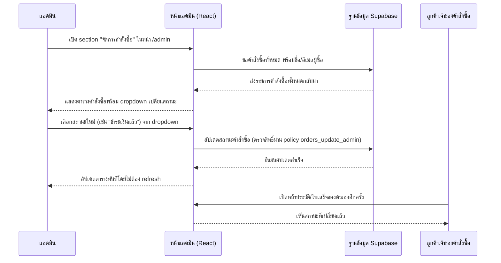

## Sequence Diagram: แอดมินจัดการสต็อกสินค้า

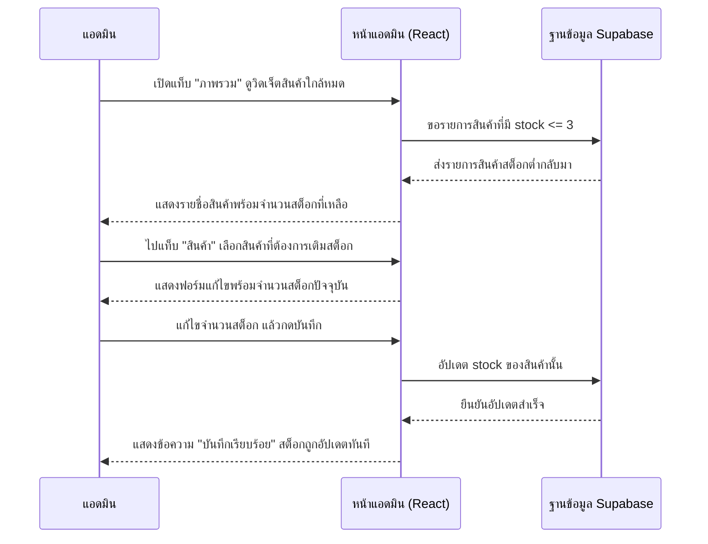

## Sequence Diagram: ผู้ใช้ทั่วไปพยายามเข้าหน้าแอดมิน (ถูกปฏิเสธสิทธิ์)

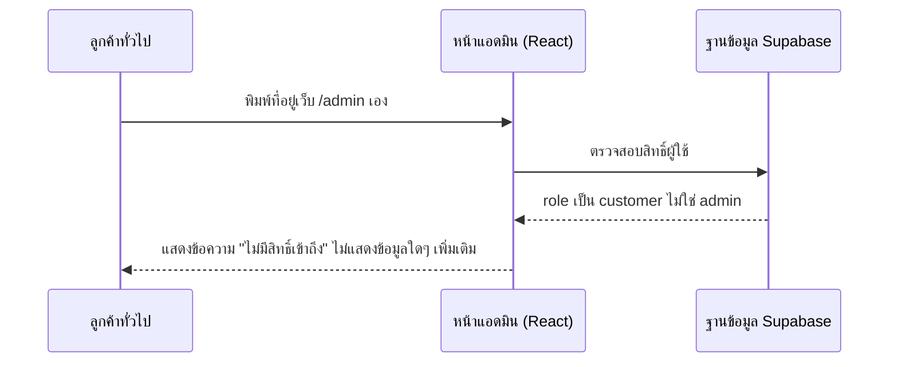
